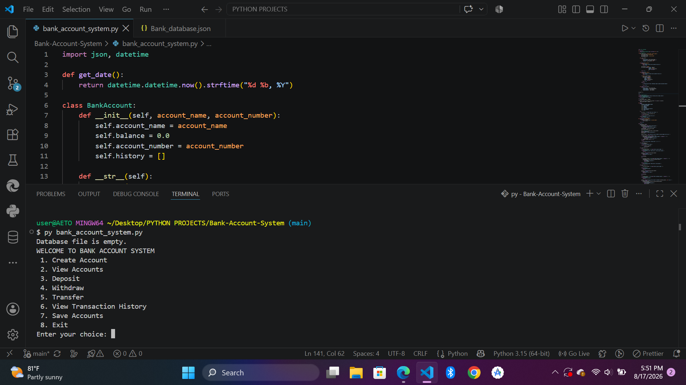
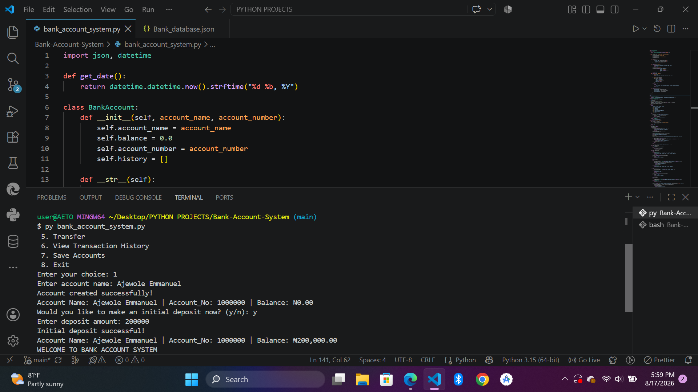
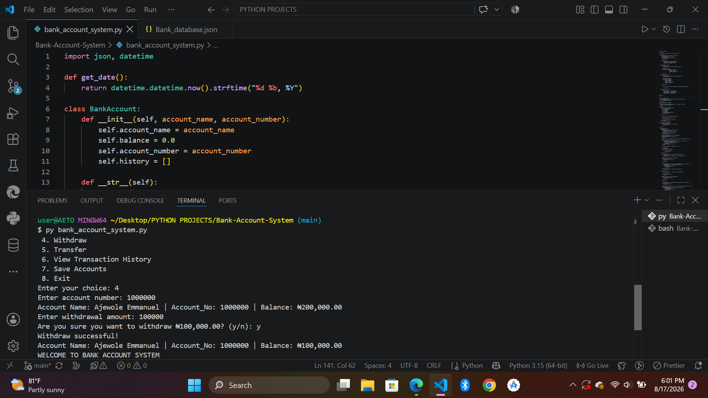
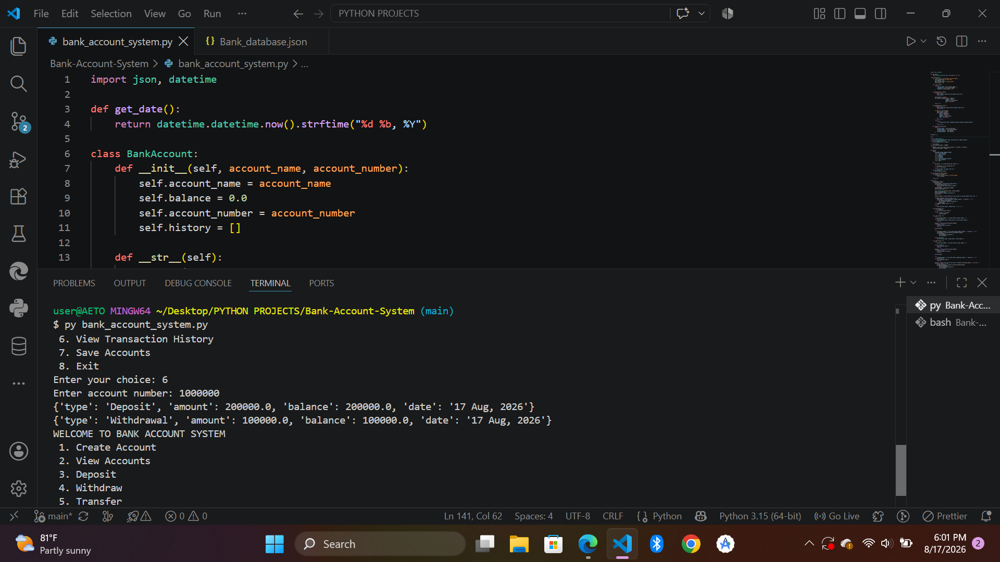
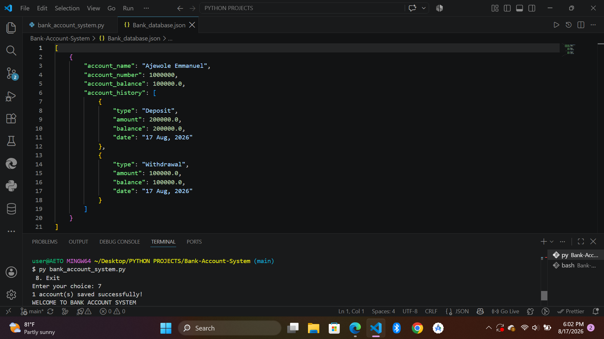

# Bank Account System

## Overview

The Bank Account System is a command-line Python application that simulates basic banking operations. Users can create multiple accounts, deposit and withdraw funds, transfer money between accounts, view transaction histories, and save account data using JSON storage. The project demonstrates Object-Oriented Programming (OOP), file handling, data persistence, and input validation in Python.

## Features

- Create multiple bank accounts
- View all existing accounts
- Deposit money into an account
- Withdraw money with balance verification
- Transfer money between accounts
- View transaction history for any account
- Save account data to JSON
- Automatically load saved accounts when the program starts
- Auto-generate unique account numbers
- Input validation and error handling

## Technologies Used

- Python
- Object-Oriented Programming (OOP)
- JSON Storage
- File Handling
- Exception Handling
- Lists and Dictionaries

## Project Structure

```text
Bank-Account-System/
│
├── bank_account_system.py
├── README.md
└── .gitignore
```

## How to Run

1. Clone the repository

```bash
git clone https://github.com/AETO-07/Bank-Account-System.git
```

2. Navigate into the project folder

```bash
cd Bank-Account-System
```

3. Run the program

```bash
python BANK_ACCOUNT_SYSTEM.py
```

## Example Workflow

1. Create an account
2. Deposit money
3. Withdraw money
4. Transfer funds to another account
5. View transaction history
6. Save accounts to JSON
7. Exit the application

## Screenshots

### Menu



### Create Account



### Withdrawal



### Transaction History



### Save Accounts



## Future Improvements

- PIN authentication
- Interest calculation for savings accounts
- SQLite database integration
- Graphical User Interface (Tkinter)
- Search accounts by name
- Export account statements

## Author

Ajewole (Temitope) Emmanuel

Computer Science Student at Obafemi Awolowo University

GitHub: https://github.com/AETO-07

LinkedIn: https://www.linkedin.com/in/ajewole-emmanuel-0941a4310/